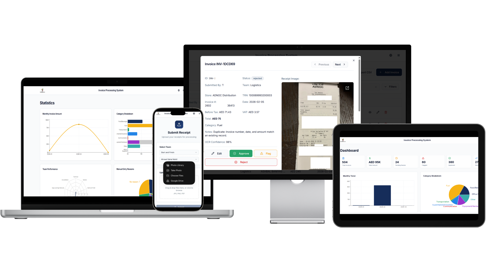

# Invoice Processing System

AI-Powered, bilingual (English/Arabic) invoice processing application built with React + Vite (frontend) and Python + FastAPI (backend). Features dual-OCR processing with LLM validation, PostgreSQL storage, and Google Drive image management.



## 🚀 Features

### User Portal
- **Team-based user selection** — two-step selection (Team → Member)
- **Receipt upload** — drag & drop support for JPG, PNG, PDF files
- **Real-time processing** — dual OCR with LLM validation and status updates
- **Manual entry fallback** — for low-quality or handwritten receipts
- **Bilingual support** — English / Arabic language toggle

### Admin Dashboard
- **Authentication** — secure login for admin access
- **Overview analytics** — key metrics, spending trends, and OCR accuracy
- **Invoice management** — search, filter, and review all invoices
- **CSV export** — download filtered invoices with image links
- **Advanced statistics** — category breakdowns, team performance, entry method analysis
- **Interactive charts** — built with Recharts for data visualization

### Backend Processing Pipeline
- **Dual OCR** — Google Cloud Vision + Azure Computer Vision in parallel
- **LLM Validation** — Google Gemini validates and extracts structured data
- **Third-Party Judge** — AWS Textract as tiebreaker on mismatches
- **Google Drive** — automated image storage with team/member folder hierarchy
- **PostgreSQL** — all data persisted in Supabase PostgreSQL

## 🛠️ Tech Stack

| Layer | Technology |
|---|---|
| **Frontend** | |
| Framework | React 18 + Vite 7 |
| Language | TypeScript |
| Styling | Tailwind CSS v3 |
| UI Components | shadcn/ui (Radix UI primitives) |
| Routing | React Router DOM v6 |
| Server State | TanStack React Query |
| Charts | Recharts |
| **Backend** | |
| Framework | Python 3 + FastAPI |
| Database | PostgreSQL (Supabase) via SQLAlchemy + asyncpg |
| OCR Services | Google Cloud Vision, Azure Computer Vision, AWS Textract |
| LLM | Google Gemini (`gemini-2.5-flash-lite` via `google-genai`) |
| File Storage | Google Drive API |
| Auth | Google OAuth 2.0 (user credentials) |

## 📁 Project Structure

```
├── index.html
├── package.json
├── vite.config.ts
├── .env                            # All credentials (Git-ignored)
│
├── src/                            # ── Frontend (React + Vite) ──
│   ├── main.tsx
│   ├── App.tsx
│   ├── index.css
│   ├── assets/
│   ├── components/
│   │   ├── AppHeader.tsx
│   │   ├── AppLayout.tsx
│   │   ├── InvoiceForm.tsx
│   │   ├── ProtectedRoute.tsx
│   │   └── ui/                     # shadcn/ui primitives
│   ├── contexts/
│   │   ├── AuthContext.tsx
│   │   └── LangContext.tsx
│   ├── data/
│   │   ├── teams.json
│   │   └── mockInvoices.ts
│   ├── hooks/
│   ├── lib/
│   │   ├── mockApi.ts
│   │   └── utils.ts
│   └── pages/
│       ├── UserPortal.tsx
│       ├── ManualEntry.tsx
│       ├── AdminLogin.tsx
│       ├── AdminDashboard.tsx
│       ├── AdminInvoices.tsx
│       ├── AdminStatistics.tsx
│       └── AdminSettings.tsx
│
└── server/                         # ── Backend (Python + FastAPI) ──
    ├── main.py                     # App entry point, CORS, lifespan
    ├── config.py                   # Pydantic Settings (.env loader)
    ├── database.py                 # SQLAlchemy models + async engine
    ├── requirements.txt            # Python dependencies
    ├── credentials/                # OAuth token storage (Git-ignored)
    ├── uploads/                    # Temp file storage (Git-ignored)
    ├── models/
    │   └── invoice.py              # Pydantic request/response models
    ├── routers/
    │   ├── upload.py               # POST /api/upload-receipts
    │   ├── status.py               # GET  /api/status/{job_id}
    │   ├── invoices.py             # Admin CRUD + review + CSV export
    │   └── statistics.py           # Dashboard analytics
    ├── services/
    │   ├── google_drive.py         # Image upload + folder management
    │   ├── processing.py           # OCR → LLM → DB pipeline
    │   ├── ocr/
    │   │   ├── google_vision.py    # Google Cloud Vision OCR
    │   │   ├── azure_cv.py         # Azure Computer Vision OCR
    │   │   └── aws_textract.py     # AWS Textract OCR (judge)
    │   └── llm/
    │       └── __init__.py         # Google Gemini prompts + validation
    ├── utils/
    │   └── image.py                # File validation (10 MB, extensions)
```

## 🔌 Backend API Endpoints

Base URL: `http://localhost:8000`

### Public

| Method | Endpoint | Description |
|---|---|---|
| `GET` | `/` | Service info and status |
| `GET` | `/health` | Health check |
| `GET` | `/docs` | Swagger UI (interactive API docs) |

### Upload & Processing

| Method | Endpoint | Description |
|---|---|---|
| `POST` | `/api/upload-receipts` | Upload receipt images (multipart form) |
| `GET` | `/api/status/{job_id}` | Poll processing job status |

**Upload request** (multipart/form-data):
- `files`: one or more image files (max 10 MB each)
- `user_name`: submitter's name
- `team`: team name

### Admin — Invoices

| Method | Endpoint | Description |
|---|---|---|
| `GET` | `/api/admin/invoices` | List invoices (filtered, paginated) |
| `POST` | `/api/admin/review/{invoice_id}` | Approve / flag / reject |
| `PATCH` | `/api/admin/invoices/{invoice_id}` | Update invoice fields |
| `POST` | `/api/admin/manual-entry` | Submit manual entry |
| `GET` | `/api/admin/export/csv` | Download CSV with image links |

**Invoice query params**: `search`, `status`, `team`, `category`, `entry_method`, `date_from`, `date_to`, `amount_min`, `amount_max`, `page`, `page_size`

**CSV export query params**: `status`, `team`, `date_from`, `date_to`

### Admin — Statistics

| Method | Endpoint | Description |
|---|---|---|
| `GET` | `/api/admin/statistics` | Dashboard metrics and analytics |

**Statistics query params**: `team`, `date_from`, `date_to`

## 🗺️ Frontend Routes

| Path | Component | Auth Required |
|---|---|---|
| `/` | `UserPortal` | No |
| `/manual-entry` | `ManualEntry` | No |
| `/admin/login` | `AdminLogin` | No |
| `/admin/dashboard` | `AdminDashboard` | Yes |
| `/admin/invoices` | `AdminInvoices` | Yes |
| `/admin/statistics` | `AdminStatistics` | Yes |
| `/admin/settings` | `AdminSettings` | Yes |

## ⚙️ Processing Pipeline

```
Receipt Upload
    ├── Google Cloud Vision OCR ──┐
    └── Azure Computer Vision ────┤
                                  ▼
                        Google Gemini LLM
                        (validate + extract)
                              │
                 ┌────────────┼────────────┐
                 ▼            ▼             ▼
              Match       Mismatch      Unresolved
                │            │             │
                │     AWS Textract         │
                │     (3rd OCR judge)      │
                │            │             ▼
                ▼            ▼       Manual Review
          Save to DB    Gemini Judge
          Upload to     (majority vote)
          Google Drive       │
                             ▼
                        Save to DB
```

## 🚀 Getting Started

### Prerequisites
- Node.js ≥ 18
- Python ≥ 3.10
- PostgreSQL database (Supabase recommended)

### Frontend Setup
```bash
npm install
npm run dev          # http://localhost:8080
```

### Backend Setup
```bash
# 1. Install Python dependencies
pip install -r server/requirements.txt

# 2. Start the API server (tables auto-created on startup)
#    On first run a browser window opens for Google OAuth consent.
#    After granting access the token is saved — no repeat consent needed.
python -m uvicorn server.main:app --reload --port 8000
```

### Environment Variables

All credentials are stored in `.env` at the project root and backend folder:

Copy the `.env.EXAMPLE` file to `.env` and fill in the values.
```bash
cp .env.EXAMPLE .env
```

```bash
cd backend
cp .env.EXAMPLE .env
```


| Variable | Service | Required |
|---|---|---|
| `GOOGLE_OAUTH_CLIENT_ID`, `GOOGLE_OAUTH_CLIENT_SECRET` | Google OAuth 2.0 (Vision + Drive) | ✅ |
| `GOOGLE_DRIVE_FOLDER_ID` | Google Drive root folder | ✅ |
| `GEMINI_API_KEY`, `Gemini_Model` | Google Gemini LLM | ✅ |
| `MS_AZ_KEY_1`, `MS_AZ_Endpoint` | Azure Computer Vision | ✅ |
| `AWS_Access_key`, `AWS_Secret_access_key` | AWS Textract | ✅ |
| `POSTGRES_URL_NON_POOLING` | Supabase PostgreSQL | ✅ |
| `CORS_ORIGINS` | Allowed frontend origins | ✅ |

## 📱 Responsive Design

- **Primary target**: mobile-first (375 px – 414 px)
- **Breakpoints**: Mobile < 640 px · Tablet 640 – 1024 px · Desktop > 1024 px
- Touch-friendly targets (min 44 × 44 px), readable text (min 14 px)


**Built with ❤️ for Emirati Marshals**
